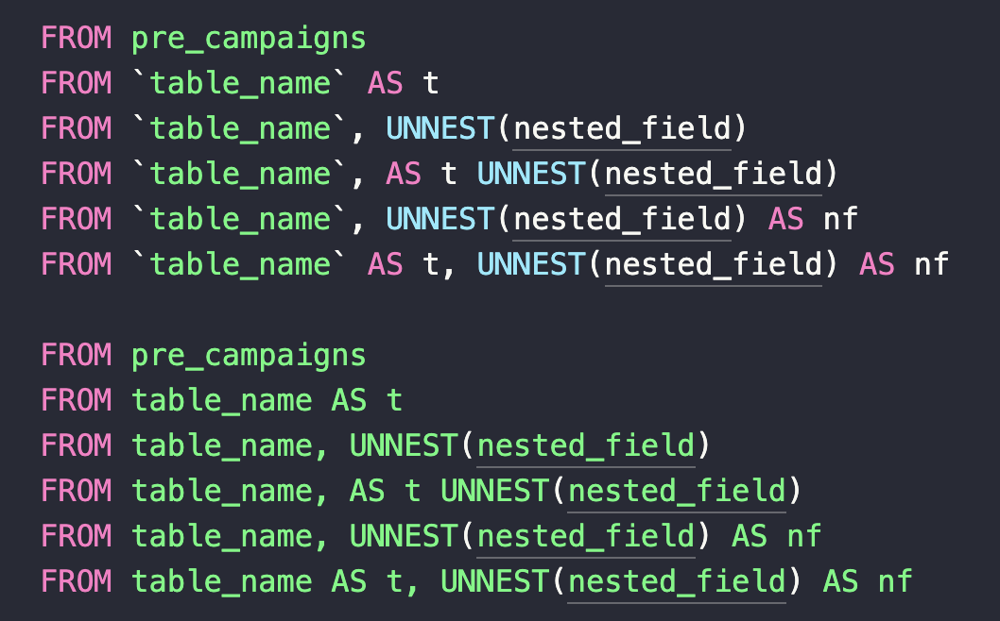
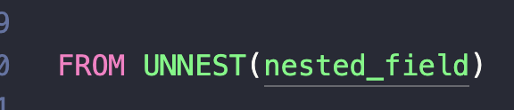
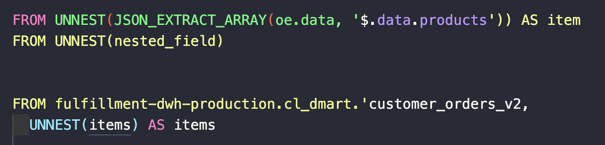
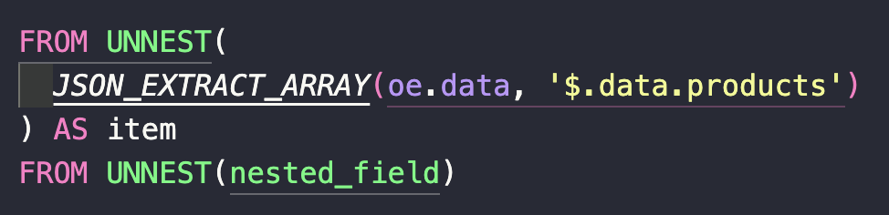

# Matching tables correctly

While aagerblad's solution is an improvement that allows for Jinja parameters to not cause major syntax highlighting
failures, it is far from perfect, and other issues still remain.

In this document I add some notes regarding this issue.

## Current status

There are two remaining issues which I explain below.

### Expressions with no backticks

Firstly, the current solution works when the targeted table is surrounded by backticks (`table_name`). The problem is
that when the targeted table is the result of a previous CTE, backticks are not allowed. The following image shows this
problem:

### FROM UNNEST issue

The second issue is that we don't always find a table name after the `FROM` keyword. In the structure `FROM UNNEST(...)`
the highlighter thinks that `UNNEST(...)` is a table.

This is especially problematic with expressions that contain characters not considered in the matching strategy. When
this happens, the matching stops, and quotations or backticks can be interpreted as opening ones, and thus cause the
entire rest of the code to be miss-highlighted, until the closing one is found.

Breaking the line in which the expression is found would solve this issue. But this is not a desired solution since
there's no other reason why the line should be broken.

